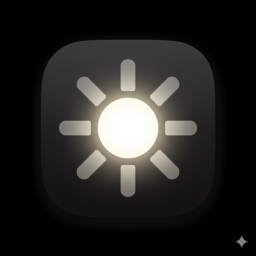

<a id="readme-top"></a>

<br />
<div align="center">
  

  <h3 align="center">Fullbright</h3>

  <p align="center">
    XDR brightness control for MacBook Pro.
    <br />
    <br />
    <a href="https://fullbright.app">Website</a>
    &middot;
    <a href="https://github.com/137137137/Fullbright/issues/new?labels=bug">Report Bug</a>
    &middot;
    <a href="https://github.com/137137137/Fullbright/issues/new?labels=enhancement">Request Feature</a>
  </p>

  [![macOS][macos-shield]][macos-url]
  [![Swift][swift-shield]][swift-url]
  [![License][license-shield]][license-url]
</div>

<br />

<details>
  <summary>Table of Contents</summary>
  <ol>
    <li><a href="#about">About</a></li>
    <li><a href="#compatibility">Compatibility</a></li>
    <li><a href="#installation">Installation</a></li>
    <li><a href="#usage">Usage</a></li>
    <li><a href="#how-it-works">How It Works</a></li>
    <li><a href="#permissions">Permissions</a></li>
    <li><a href="#building-from-source">Building from Source</a></li>
    <li><a href="#architecture">Architecture</a></li>
    <li><a href="#safety">Safety</a></li>
    <li><a href="#contributing">Contributing</a></li>
    <li><a href="#license">License</a></li>
  </ol>
</details>

## About

MacBook Pro XDR displays go up to 1600 nits but macOS caps you at ~500 in normal use. Fullbright removes that cap.

Menu bar app. Toggles XDR. Intercepts your brightness keys and gives you control over the full 1-1600 nit range. Uses Apple's private SkyLight framework to switch display presets.

I wanted something simple and open source that just did this one thing.

<p align="right">(<a href="#readme-top">back to top</a>)</p>

## Compatibility

| Model | Chip | |
|-------|------|:-:|
| MacBook Pro 14" | M1 Pro/Max+ | ✓ |
| MacBook Pro 16" | M1 Pro/Max+ | ✓ |
| Pro Display XDR | | ✓ |

macOS 13.0+

<p align="right">(<a href="#readme-top">back to top</a>)</p>

## Installation

Download the `.dmg` from [Releases](https://github.com/137137137/Fullbright/releases), drag to Applications. If macOS complains about unidentified developer, right-click > Open.

Lives in the menu bar. No Dock icon by default (changeable in settings).

<p align="right">(<a href="#readme-top">back to top</a>)</p>

## Usage

1. Click the icon in the menu bar
2. Toggle XDR on
3. Use brightness keys for 1-1600 nit range

Custom OSD shows current nits. Bottom half of the slider is SDR (1-500 nits), top half is XDR (500-1600). Turning XDR off restores your previous brightness and Night Shift state.

<p align="right">(<a href="#readme-top">back to top</a>)</p>

## How It Works

**XDR on:**
1. Hardware brightness + linear brightness to 1.0
2. Disable ambient light compensation (fights gamma changes otherwise)
3. Disable Night Shift (breaks gamma precision)
4. Clear gamma mods via ColorSync
5. Spawn 2x2px `CAMetalLayer` window in `extendedLinearITUR_2020` (triggers EDR headroom allocation)
6. 2s delay for EDR, then scale system gamma table and reapply at 60Hz

**Brightness:** Default gamma table read once at launch, R/G/B scaled with vDSP, reapplied 60x/sec. 30% lerp per frame for smooth transitions.

**XDR off:** Stop gamma timer, restore ColorSync, restore Night Shift if it was on, re-enable auto brightness, restore previous brightness.

<p align="right">(<a href="#readme-top">back to top</a>)</p>

## Permissions

**Accessibility** required for CGEventTap (brightness key interception). macOS prompts on first use.

Network access to `fullbright.app` for license validation and Sparkle update checks. Certificate pinned to ISRG Root X1.

<p align="right">(<a href="#readme-top">back to top</a>)</p>

## Building from Source

```bash
git clone https://github.com/137137137/Fullbright.git
cd Fullbright/Fullbright
open Fullbright.xcodeproj
```

Set your signing team, build. Xcode 15+, macOS 13.0+ SDK. Only dependency is [Sparkle](https://sparkle-project.org) via SPM.

### Licensing

The source includes a trial/license system (14-day trial, license keys, server validation) used by the distributed version at [fullbright.app](https://fullbright.app). To build without it, strip the `Authentication/` directory and the auth state checks in `AppCoordinator`, or hardcode auth state to `.authenticated`. XDR code has no licensing gates, it's all in `Core/Controllers/`.

<p align="right">(<a href="#readme-top">back to top</a>)</p>

## Architecture

```
Fullbright/
├── App/
│   ├── AppCoordinator          Composition root
│   ├── AppDelegate             Lifecycle, signal handlers, crash recovery
│   └── FullbrightApp           SwiftUI entry
│
├── Core/
│   ├── Controllers/
│   │   ├── XDRController       Enable/disable/brightness
│   │   ├── GammaTableManager   Read, scale, 60Hz reapply
│   │   ├── BrightnessKeyManager  CGEventTap, key interception
│   │   ├── DisplayServicesClient  DisplayServices.framework
│   │   ├── NightShiftManager   CBBlueLightClient
│   │   └── HDRWindow           CAMetalLayer for EDR
│   ├── Protocols/
│   └── Utilities/
│
├── Authentication/
│   ├── Managers/               Trial, license, server
│   ├── Models/                 State, data structs
│   └── Security/               Keychain, AES-GCM, cert pinning
│
├── Features/
│   ├── MenuBar/
│   ├── OSD/
│   ├── Settings/
│   ├── Onboarding/
│   └── Updates/
│
└── Components/
```

MVVM, `@Observable`, protocol DI via `AppCoordinator`. Display ops on `@MainActor`. CGEventTap callback is C convention, uses `OSAllocatedUnfairLock` for cross-thread state.

Private frameworks: `SkyLight` (display presets), `DisplayServices` (brightness), `CoreBrightness` (Night Shift).

<p align="right">(<a href="#readme-top">back to top</a>)</p>

## Safety

Apple throttles pixel brightness at the firmware level if the panel overheats. Fullbright can't bypass that.

If the app crashes with modified gamma (screen looks washed out):
- Dirty-gamma flag is set before modifying, cleared after restore
- On next launch, if flag is set, gamma resets immediately
- SIGTERM/SIGINT handlers restore gamma on quit

Relaunch fixes everything. Nothing permanent.

<p align="right">(<a href="#readme-top">back to top</a>)</p>

## Contributing

PRs welcome. Open an issue first for anything big.

<p align="right">(<a href="#readme-top">back to top</a>)</p>

## License

MIT

<p align="right">(<a href="#readme-top">back to top</a>)</p>

<!-- SHIELDS -->
[macos-shield]: https://img.shields.io/badge/macOS-13.0+-111111?style=flat&logo=apple&logoColor=white
[macos-url]: https://www.apple.com/macos/
[swift-shield]: https://img.shields.io/badge/Swift-5.9+-F05138?style=flat&logo=swift&logoColor=white
[swift-url]: https://swift.org
[license-shield]: https://img.shields.io/badge/License-MIT-97CA00?style=flat
[license-url]: https://github.com/137137137/Fullbright/blob/main/LICENSE
